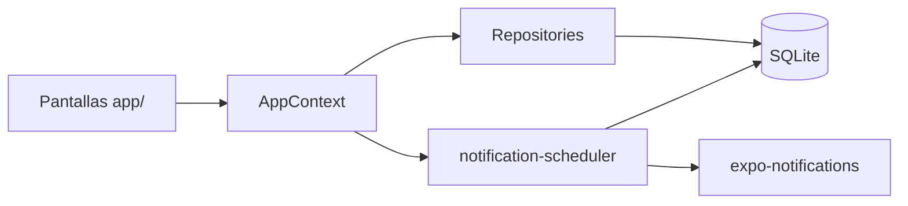

# FlowShift — Arquitectura MVP

## Estructura de carpetas

```
flow-shift/
├── app/                          # Expo Router (presentación)
│   ├── _layout.tsx               # AppProvider + navegación
│   └── (tabs)/
│       ├── index.tsx             # Inicio de jornada
│       ├── blocks.tsx            # CRUD time_blocks
│       ├── alerts.tsx            # Parámetros numéricos de alertas
│       └── settings.tsx          # Kill switches + reset fábrica
├── src/
│   ├── domain/                   # Entidades y reglas de tipos
│   │   ├── types/
│   │   └── constants/toggle-keys.ts
│   ├── data/repositories/        # Acceso SQLite (implementación)
│   ├── infrastructure/
│   │   ├── database/             # schema, seed, connection, mappers
│   │   └── notifications/        # permisos y canal Android
│   ├── application/services/     # Casos de uso (scheduler, time-utils)
│   └── presentation/
│       ├── context/AppContext.tsx
│       └── components/
├── .cursor/rules/                # Reglas Cursor para contexto persistente
├── app.json                      # EAS Update + plugins
└── eas.json                      # Perfiles de build y canales
```

## Flujo de datos



## Decisiones de diseño

1. **Singleton de DB**: evita múltiples conexiones al reprogramar desde varias pestañas.
2. **Seed separado del esquema**: OTA puede actualizar JS sin tocar datos del usuario; reset explícito reinserta fábrica.
3. **toggle-keys**: el código referencia IDs de filas, no valores de negocio.
4. **Reprogramación centralizada**: cualquier mutación que afecte tiempos pasa por `syncNotifications`.
5. **runtimeVersion por appVersion**: alineado con EAS; migraciones en `migrations.ts` (`LATEST_DB_VERSION`).
6. **Development build**: `expo-dev-client` + `npm run run:android` / EAS profile `development`.

## EAS Update y SQLite

Las actualizaciones OTA entregan JavaScript nuevo; **no** borran `flowshift.db` del dispositivo. Cambios de esquema requieren migraciones versionadas en código, no en el bundle OTA solo.

Reemplazar `YOUR_EAS_PROJECT_ID` en `app.json` tras `eas init`.

## Ejecución

```bash
# Expo Go (limitado en notificaciones Android SDK 53+)
npm start

# Development build local (recomendado para notificaciones)
npm run run:android
npm run start:dev

# EAS development build
eas init
npm run build:dev:android
```

### Actualizaciones OTA (EAS Update)

- Al iniciar: `ON_LOAD` descarga en background + `UpdatesOnLaunch` pide confirmación antes de reiniciar.
- En **Ajustes**: info de build (colapsable), buscar, descargar e instalar manualmente.
- Publicar: `eas update --channel production` (o el canal del build).

### Añadir migración de esquema

1. Incrementar `LATEST_DB_VERSION` en `migrations.ts`.
2. Registrar función en `MIGRATIONS[version]` (ALTER TABLE idempotente con `IF NOT EXISTS` cuando aplique).
3. No borrar `schema_migrations` en reset de fábrica.
