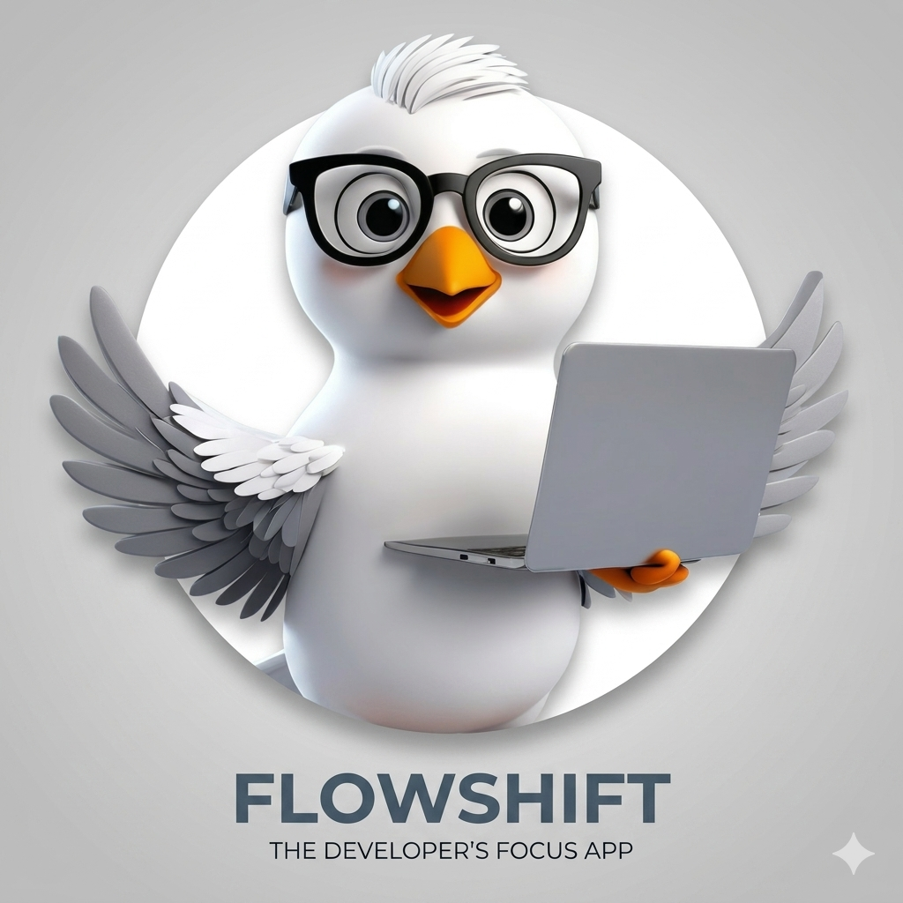
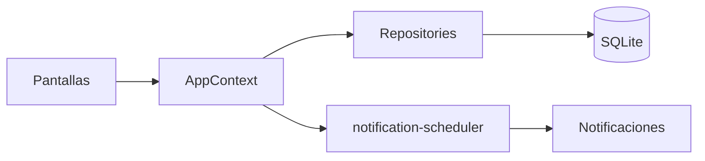

<p align="center">
  
</p>

<h1 align="center">FlowShift</h1>

<p align="center">
  <strong>Gestión de estados mentales y productividad con tiempos relativos, SQLite y alertas locales.</strong>
</p>

<p align="center">
  
  &nbsp;100% parametrizable — cero horarios fijos en código&nbsp;
  
</p>

<p align="center">
  <a href="https://docs.expo.dev/versions/v54.0.0/"></a>
  <a href="https://www.typescriptlang.org/"></a>
  
  
</p>

---

## Qué es FlowShift

FlowShift ayuda a estructurar tu jornada en **bloques de enfoque** (Reactivo, Deep Work, Aprendizaje) con **offsets en minutos** desde la hora de inicio que elijas cada día — no hay “las 9:00 en el código”, solo datos en base de datos.

Al guardar cualquier cambio en bloques o alertas, la app **cancela y reprograma** todas las notificaciones locales al instante.

<p align="center">
  
</p>

---

## Características

<table>
<tr>
<td width="48" align="center"></td>
<td><strong>Inicio de jornada</strong><br/>Atajos 7:00 / 8:00 AM (o hora personalizada). Un toque calcula y programa todo el día.</td>
</tr>
<tr>
<td align="center"></td>
<td><strong>Bloques de tiempo (CRUD)</strong><br/>Crear, editar y eliminar bloques con estado mental, offset y duración.</td>
</tr>
<tr>
<td align="center"></td>
<td><strong>Alertas parametrizables</strong><br/>Pausas activas, comida, inglés, límite de descanso — frecuencias y offsets en SQLite.</td>
</tr>
<tr>
<td align="center"></td>
<td><strong>Kill switches</strong><br/>Activa o desactiva cada tipo de alerta desde Ajustes.</td>
</tr>
<tr>
<td align="center"></td>
<td><strong>Actualizaciones OTA</strong><br/>Comprobación automática al abrir (<code>ON_LOAD</code>) + control manual en Ajustes.</td>
</tr>
<tr>
<td align="center"></td>
<td><strong>Valores de fábrica</strong><br/>Restablece seed inicial sin perder el esquema migrado.</td>
</tr>
</table>

---

## Pantallas

| Pestaña     | Función                                                      |
| ----------- | ------------------------------------------------------------ |
| **Inicio**  | Iniciar / finalizar jornada, contador de alertas programadas |
| **Bloques** | Lista y CRUD de `time_blocks`                                |
| **Alertas** | Parámetros numéricos (`habit_toggles` tipo `alert_config`)   |
| **Ajustes** | Kill switches, OTA, reset de fábrica                         |

---

## Stack técnico

| Capa           | Tecnología                     |
| -------------- | ------------------------------ |
| UI             | React Native · Expo Router 6   |
| Lenguaje       | TypeScript (strict, sin `any`) |
| Persistencia   | `expo-sqlite` (`flowshift.db`) |
| Notificaciones | `expo-notifications`           |
| OTA            | `expo-updates` + EAS           |
| Builds         | `expo-dev-client`              |

Arquitectura detallada → [`ARCHITECTURE.md`](./ARCHITECTURE.md)



---

## Requisitos

- Node.js 18+
- npm
- [EAS CLI](https://docs.expo.dev/build/setup/) (para builds y OTA)
- Android Studio / Xcode (solo si compilas nativo en local)

---

## Inicio rápido

```bash
# Clonar e instalar
npm install

# Desarrollo (Expo Go — notificaciones limitadas en Android)
npm start

# Development build (recomendado)
npm run run:android
npm run start:dev
```

### Scripts útiles

| Comando                     | Descripción                       |
| --------------------------- | --------------------------------- |
| `npm start`                 | Metro / Expo Go                   |
| `npm run start:dev`         | Metro con dev client              |
| `npm run run:android`       | Compilar y ejecutar Android local |
| `npm run run:ios`           | Compilar y ejecutar iOS local     |
| `npm run typecheck`         | Verificación TypeScript           |
| `npm run lint`              | ESLint                            |
| `npm run build:dev:android` | EAS build perfil `development`    |

---

## EAS Build y OTA

<p align="left">
  
  &nbsp;&nbsp;Las actualizaciones OTA <strong>no borran</strong> tu SQLite local. El esquema migra en código al abrir la app.
</p>

<br/>

```bash
# Primera vez
eas login
eas init   # si aún no está vinculado el proyecto

# Build de preview / producción
eas build --profile preview --platform android

# Publicar update JS al canal del build
eas update --channel preview --message "Descripción del cambio"
```

**Comportamiento OTA**

| Momento         | Qué ocurre                                                           |
| --------------- | -------------------------------------------------------------------- |
| Al abrir la app | `ON_LOAD` busca y descarga updates en background                     |
| Tras descarga   | Diálogo: confirmación antes de reiniciar (`UpdatesOnLaunch`)         |
| Ajustes         | Buscar · Descargar · Instalar manualmente + info de build colapsable |

---

## Estructura del proyecto

```
flow-shift/
├── app/(tabs)/          # Pantallas Expo Router
├── src/
│   ├── domain/          # Tipos y constantes
│   ├── data/            # Repositorios SQLite
│   ├── infrastructure/  # DB, migraciones, notificaciones
│   ├── application/     # Scheduler, OTA, tiempo relativo
│   └── presentation/    # Context, componentes
├── assets/images/       # Icono y splash-icon de la app
└── .cursor/rules/       # Reglas para agentes IA
```

---

## Base de datos (resumen)

| Tabla               | Uso                                          |
| ------------------- | -------------------------------------------- |
| `app_configs`       | Hora de inicio del día y jornada activa      |
| `time_blocks`       | Bloques con offset, duración y estado mental |
| `habit_toggles`     | Kill switches y parámetros de alertas        |
| `schema_migrations` | Versionado de esquema                        |

Datos iniciales solo en `src/infrastructure/database/seed.ts`.

---

## Desarrollo con Cursor

El repo incluye reglas en `.cursor/rules/`:

- `flowshift-architecture.mdc` — parametrización y capas
- `flowshift-persistence.mdc` — SQLite y `AppContext`
- `typescript-imports.mdc` — imports solo en cabecera

---

## Licencia

Proyecto privado — Tecnosolutions / uso del titular del repositorio.

---

<p align="center">
  
  <br/>
  <sub>FlowShift · Hecho con Expo</sub>
</p>
